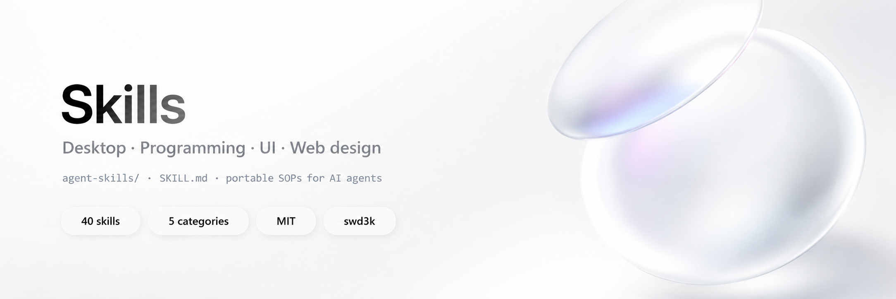

<p align="center">
  
</p>

<br>

<h1 align="center">Skills</h1>

<p align="center">
  Portable <strong>agent skills</strong> for building <strong>desktop apps</strong>, solid
  <strong>programming workflows</strong>, product <strong>UI</strong>, and
  <strong>web design</strong> — for Codex, Claude, Cursor, Grok, and other AI coding agents.
</p>

<p align="center">
  
  
  
  
  <a href="https://github.com/swd3k"></a>
  
</p>

<p align="center">
  Developer: <a href="https://github.com/swd3k">swd3k</a>
  ·
  <a href="#-library">Library</a>
  ·
  <a href="#-how-to-use">How to use</a>
  ·
  <a href="LICENSE">MIT</a>
</p>

---

> [!NOTE]
> Inspired by the folder contract from [MengTo/Skills](https://github.com/MengTo/Skills).  
> This library is **original content** focused on **desktop engineering**, **product programming**,
> **interface systems**, and **practical web design** — not a mirror of that repo.

Concise `SKILL.md` playbooks with defaults, steps, pitfalls, and acceptance checks.  
Load the narrowest matching skill before acting. Keep project-specific rules in your own `AGENTS.md` / `CLAUDE.md`.

---

> [!IMPORTANT]
> ### What this is
> - Versioned **operating procedures** for AI agents and humans  
> - Portable across repos (no secrets, no private paths)  
> - English by design (best model compliance)  
>
> ### What this is not
> - A framework or npm package  
> - Copy-paste of third-party proprietary prompts  
> - A replacement for your product’s own docs

---

## Why it exists

| Problem | Skill approach |
|---------|----------------|
| One-off chat answers | Reusable procedures |
| Vague “make it nice” | Defaults + constraints |
| White screens / broken CI | Ordered checklists |
| Version drift / bad installers | Release and packaging playbooks |
| Pretty UI that fails in product | States, a11y, desktop density |

---

## Philosophy

1. **Prompts are assets** — if it worked once, version it.  
2. **Specs beat vibes** — hierarchy, tokens, “change 1–2 things only”.  
3. **References beat paragraphs** — screenshots and demos when visual.  
4. **Skills are SOPs** — when to use, what first, defaults, what to avoid.

---

## Folder contract

```text
agent-skills/
  <category>/
    <skill-name>/
      SKILL.md            # required — frontmatter + workflow
      REFERENCES.md       # optional — links only
      ARTICLE.md          # optional — long-form
      demo/               # optional — proof (HTML / prompts)
```

```yaml
---
name: skill-folder-name
description: What it does + when to use it (triggers).
---
```

Conventions:

- Procedural steps, not encyclopedias  
- Explicit triggers: *“Use when…”*  
- Defaults, snippets, pitfalls, acceptance checks  
- No secrets / no machine-specific paths  

---

## Library

**40 skills · 5 categories**

### Desktop apps (8)

Windows-first and cross-platform shells, packaging, privileges, updates.

| Skill | Summary |
|-------|---------|
| [`photino-webview2-desktop`](agent-skills/desktop-apps/photino-webview2-desktop/SKILL.md) | Photino.NET + WebView2 apps, UI load, host bridge |
| [`electron-desktop-app`](agent-skills/desktop-apps/electron-desktop-app/SKILL.md) | Electron main/preload security and packaging |
| [`tauri-desktop-app`](agent-skills/desktop-apps/tauri-desktop-app/SKILL.md) | Tauri 2 lightweight multi-OS apps |
| [`windows-installer-inno`](agent-skills/desktop-apps/windows-installer-inno/SKILL.md) | Inno Setup 6 + CI-safe official installer download |
| [`elevate-privileges-safely`](agent-skills/desktop-apps/elevate-privileges-safely/SKILL.md) | asInvoker + elevate only the privileged action |
| [`desktop-tray-and-window`](agent-skills/desktop-apps/desktop-tray-and-window/SKILL.md) | Tray, single-instance, window lifecycle |
| [`github-autoupdate-desktop`](agent-skills/desktop-apps/github-autoupdate-desktop/SKILL.md) | In-app updates from GitHub Releases |
| [`publish-fdd-vs-self-contained`](agent-skills/desktop-apps/publish-fdd-vs-self-contained/SKILL.md) | .NET FDD vs self-contained publish choices |

### Programming (9)

Architecture, debugging, CI/CD, versions, tests, reviews.

| Skill | Summary |
|-------|---------|
| [`clean-architecture-layers`](agent-skills/programming/clean-architecture-layers/SKILL.md) | Core / Infrastructure / UI dependency rules |
| [`systematic-debugging`](agent-skills/programming/systematic-debugging/SKILL.md) | Reproduce → isolate → fix → regress |
| [`github-actions-release`](agent-skills/programming/github-actions-release/SKILL.md) | Tag-driven Actions release pipelines |
| [`semver-and-version-sync`](agent-skills/programming/semver-and-version-sync/SKILL.md) | Keep assembly, UI, installer, tag in sync |
| [`write-focused-tests`](agent-skills/programming/write-focused-tests/SKILL.md) | High-value unit/integration tests |
| [`safe-refactor`](agent-skills/programming/safe-refactor/SKILL.md) | Structure changes without behavior risk |
| [`commit-messages-russian`](agent-skills/programming/commit-messages-russian/SKILL.md) | Conventional Russian commit subjects |
| [`api-rest-design`](agent-skills/programming/api-rest-design/SKILL.md) | Practical REST/JSON API shape |
| [`code-review-pass`](agent-skills/programming/code-review-pass/SKILL.md) | PR review order and blocking criteria |

### UI / interface (9)

Product UI systems for tools and apps (not only marketing).

| Skill | Summary |
|-------|---------|
| [`design-first-ui-prompting`](agent-skills/ui/design-first-ui-prompting/SKILL.md) | Spec-driven UI prompts and variants |
| [`desktop-window-ui`](agent-skills/ui/desktop-window-ui/SKILL.md) | Dense desktop window layouts |
| [`form-ux-patterns`](agent-skills/ui/form-ux-patterns/SKILL.md) | Labels, validation, submit states |
| [`loading-empty-error-states`](agent-skills/ui/loading-empty-error-states/SKILL.md) | Never ship blank or silent failure UI |
| [`dark-mode-system`](agent-skills/ui/dark-mode-system/SKILL.md) | Light/dark tokens and system mode |
| [`design-tokens-css`](agent-skills/ui/design-tokens-css/SKILL.md) | Minimal token set for consistency |
| [`accessibility-basics`](agent-skills/ui/accessibility-basics/SKILL.md) | Keyboard, focus, contrast, reduced motion |
| [`microcopy-ui`](agent-skills/ui/microcopy-ui/SKILL.md) | Buttons, errors, empty-state copy |
| [`iconography-system`](agent-skills/ui/iconography-system/SKILL.md) | One icon family, sizing, labels |

### Web design (10)

Landings, marketing polish, type, motion, docs, Tailwind craft.

| Skill | Summary |
|-------|---------|
| [`landing-page`](agent-skills/web-design/landing-page/SKILL.md) | High-conversion single-offer pages |
| [`pricing-page`](agent-skills/web-design/pricing-page/SKILL.md) | Tiers, comparison, billing FAQ |
| [`polished-marketing-site`](agent-skills/web-design/polished-marketing-site/SKILL.md) | Premium marketing/portfolio quality bar |
| [`responsive-layout-system`](agent-skills/web-design/responsive-layout-system/SKILL.md) | Containers, breakpoints, overflow safety |
| [`web-typography-system`](agent-skills/web-design/web-typography-system/SKILL.md) | Scales, measure, hierarchy |
| [`css-motion-fundamentals`](agent-skills/web-design/css-motion-fundamentals/SKILL.md) | Purposeful, accessible motion |
| [`glass-depth-ui`](agent-skills/web-design/glass-depth-ui/SKILL.md) | Restrained glass and elevation |
| [`product-docs-page`](agent-skills/web-design/product-docs-page/SKILL.md) | README/docs structure that ships |
| [`portfolio-personal-site`](agent-skills/web-design/portfolio-personal-site/SKILL.md) | Personal/portfolio sites |
| [`tailwind-layout-craft`](agent-skills/web-design/tailwind-layout-craft/SKILL.md) | Disciplined Tailwind layouts |

### Workflows (4)

Cross-cutting agent loops used across the library.

| Skill | Summary |
|-------|---------|
| [`screenshot-to-ui-spec`](agent-skills/workflows/screenshot-to-ui-spec/SKILL.md) | Screenshot/video → implementation spec |
| [`white-screen-debug`](agent-skills/workflows/white-screen-debug/SKILL.md) | Blank UI checklist (web + WebView2) |
| [`ship-desktop-release`](agent-skills/workflows/ship-desktop-release/SKILL.md) | End-to-end desktop GitHub release |
| [`agent-skill-authoring`](agent-skills/workflows/agent-skill-authoring/SKILL.md) | How to write skills in this repo |

Source of truth:

```bash
# PowerShell
Get-ChildItem agent-skills -Recurse -Filter SKILL.md | Sort-Object FullName
```

---

## How to use

### Codex / Claude Code / Cursor / Grok

1. Clone or submodule this repo (or copy the skills you need).  
2. Point the agent at the matching `SKILL.md` (or install into your agent’s skills dir).  
3. Prefer **one narrow skill** over loading the whole tree.  
4. Keep product secrets and local paths in **your** project instructions, not here.

### Suggested install paths

| Agent | Typical location |
|-------|------------------|
| Claude Code | `.claude/skills/` or user skills dir |
| Codex | project skills / instructions load |
| Cursor | rules or `@`-reference skill folder |
| Grok | `~/.grok/skills/` or project `.grok/skills/` |

Example (copy one category):

```bash
git clone https://github.com/swd3k/skills.git
# then link or copy agent-skills/desktop-apps/* into your agent skills folder
```

### Flagship paths

| You want… | Start with |
|-----------|------------|
| Photino / WebView2 Windows tool | `photino-webview2-desktop` → `elevate-privileges-safely` → `windows-installer-inno` |
| Tag release that builds Setup.exe | `github-actions-release` → `ship-desktop-release` |
| Blank / white UI | `white-screen-debug` → `loading-empty-error-states` |
| Landing page | `landing-page` → `web-typography-system` → `css-motion-fundamentals` |
| New skill in this repo | `agent-skill-authoring` |

---

## Agent support

| Agent | Notes |
|-------|--------|
| **Codex** | Load relevant `SKILL.md` before acting |
| **Claude Code** | Skills dir or paste `SKILL.md` into context |
| **Cursor** | `@` skill folder / project rules |
| **Grok** | User or project skills with same frontmatter |
| **Others** | Same contract: narrow skill first, then implement |

---

## Add a skill

1. Create `agent-skills/<category>/<skill-name>/`.  
2. Add `SKILL.md` with `name` + `description` frontmatter.  
3. Optional: `REFERENCES.md`, `ARTICLE.md`, `demo/`.  
4. Validate: trigger, steps, defaults, pitfalls, acceptance.  
5. Commit: `docs: add <skill-name> skill` (or `feat:` if you treat skills as product).

See [`agent-skill-authoring`](agent-skills/workflows/agent-skill-authoring/SKILL.md).

---

## Structure

```text
skills/
├── README.md
├── LICENSE
├── docs/
│   └── banner.png
└── agent-skills/
    ├── desktop-apps/
    ├── programming/
    ├── ui/
    ├── web-design/
    └── workflows/
```

---

## Writing style

- English, skimmable, practical  
- Constraints and defaults over fluff  
- Long essays → `ARTICLE.md`  
- Links only → `REFERENCES.md`  

---

## Related

- [MengTo/Skills](https://github.com/MengTo/Skills) — design-heavy skill collection (format inspiration)  
- [swd3k](https://github.com/swd3k) — product repos that these skills were battle-tested against  

---

## License

MIT. See [LICENSE](LICENSE).

---

<p align="center">
  <sub>Official source: <a href="https://github.com/swd3k/skills">github.com/swd3k/skills</a> · author <a href="https://github.com/swd3k">swd3k</a></sub>
</p>
